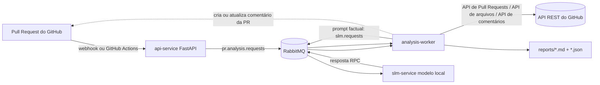

# Analisador de Qualidade de PR

Um serviço focado no GitHub para análise da qualidade de *Pull Requests* (PRs). Ele recebe eventos de PR do GitHub ou solicitações manuais de análise, coleta os arquivos modificados por meio da API REST do GitHub, executa verificações determinísticas de qualidade de código, envia um contexto normalizado para um SLM local por meio do RabbitMQ, gera relatórios em Markdown/JSON e publica o relatório final como um comentário gerenciado na *Pull Request*.

## O que está incluído

* **Endpoint de webhook do GitHub** para eventos `pull_request`.
* **Endpoint de análise manual** para GitHub Actions ou reexecuções locais.
* **Filas RabbitMQ** para trabalhos de análise de PR e solicitações de inferência do SLM.
* **Worker de análise** que obtém metadados e arquivos da PR no GitHub, avalia riscos e prepara um contexto factual para revisão.
* **Serviço de inferência SLM** como uma imagem Docker separada.
* **Comentário gerenciado na PR do GitHub**: o analisador cria ou atualiza um único comentário na linha do tempo da PR em vez de criar duplicados.
* **Artefatos locais**: relatórios em Markdown e JSON salvos no diretório `reports/`.

## Arquitetura



## Inicialização rápida local

1. Crie o arquivo `.env`:

```bash
cp .env.example .env
```

2. Preencha os valores obrigatórios do GitHub:

```env
GITHUB_TOKEN=github_pat_ou_gh_token
GITHUB_WEBHOOK_SECRET=altere-este-valor
POST_PR_COMMENT=true
UPDATE_EXISTING_PR_COMMENT=true
```

3. Inicie a stack:

```bash
docker compose up --build
```

A interface do RabbitMQ estará disponível em `http://localhost:15672` com usuário `guest` e senha `guest`. A API estará disponível em `http://localhost:8080`.

4. Envie uma solicitação manual de análise de PR do GitHub:

```bash
curl -X POST http://localhost:8080/analyze \
  -H "Content-Type: application/json" \
  -d '{
    "owner": "my-org",
    "repo": "my-repo",
    "pull_number": 42,
    "post_comment": true
  }'
```

O *worker* buscará a PR no GitHub, analisará os arquivos modificados, salvará os relatórios em `./reports` e criará ou atualizará o comentário da PR.

## Teste rápido sem GitHub

Você pode fornecer os arquivos modificados diretamente na requisição. Isso é útil para testes locais sem um repositório real. O exemplo abaixo desabilita a publicação de comentários na PR.

```bash
curl -X POST http://localhost:8080/analyze \
  -H "Content-Type: application/json" \
  --data @examples/local_job.json
```

## Configuração do webhook do GitHub

Configure um webhook no seu repositório GitHub:

* URL de payload: `https://<seu-dominio>/webhook/github`
* Tipo de conteúdo: `application/json`
* Segredo: valor de `GITHUB_WEBHOOK_SECRET`
* Eventos: `Pull requests`

A API valida o cabeçalho `X-Hub-Signature-256` quando `GITHUB_WEBHOOK_SECRET` estiver configurado.

Ações de PR suportadas:

```text
opened
synchronize
reopened
ready_for_review
```

## Opção com GitHub Actions

O workflow incluído pode executar o analisador dentro do GitHub Actions e publicar o relatório de volta na PR.

Arquivo do workflow:

```text
.github/workflows/pr-quality.yml
```

Permissões necessárias:

```yaml
permissions:
  contents: read
  pull-requests: read
  issues: write
```

Por que `issues: write` é necessário: no GitHub, *Pull Requests* também são tratadas como *issues* para comentários na linha do tempo. Por isso, o analisador publica o relatório utilizando o endpoint de comentários de *issues*.

O workflow inicia localmente os contêineres RabbitMQ, API, worker e SLM, chama o endpoint `/analyze`, aguarda a geração do relatório, faz o upload dos artefatos gerados e atualiza o comentário da PR.

## Comportamento do comentário na PR

O relatório é publicado como um comentário na linha do tempo da *Pull Request*.

Para evitar comentários duplicados do bot, o *worker* adiciona um marcador oculto:

```html
<!-- pr-quality-analyzer-report -->
```

Nas atualizações subsequentes da PR, o *worker* procura comentários existentes contendo esse marcador. Se encontrar um, ele atualiza o comentário. Caso contrário, cria um novo.

Configurações relacionadas:

```env
POST_PR_COMMENT=true
UPDATE_EXISTING_PR_COMMENT=true
```

## Como o relatório é construído

O relatório é construído em duas etapas.

### 1. Fatos determinísticos

O *worker* analisa:

* tamanho da PR;
* quantidade de arquivos modificados;
* linhas adicionadas/removidas;
* alterações em dependências e arquivos de bloqueio (*lock files*);
* alterações em Docker, CI/CD e infraestrutura;
* alterações em arquivos de teste;
* caminhos sensíveis como `auth`, `security`, `payment`, `migrations`, `iam` e `secrets`;
* padrões Python de risco, como `eval`, `exec`, `pickle.loads`, `shell=True`, `except` genérico, `print` de depuração e marcadores `TODO/FIXME/HACK`;
* possíveis vazamentos de segredos, como tokens GitHub, chaves AWS, chaves privadas e atribuições genéricas de segredos;
* ausência de descrição da PR.

### 2. Contexto de revisão fornecido pelo SLM

O SLM recebe apenas fatos estruturados e trechos limitados dos diffs. Ele não toma a decisão final de aprovação. Seu papel é produzir contexto orientado ao revisor, incluindo:

* resumo para o revisor;
* principais riscos;
* verificações manuais recomendadas;
* perguntas para o autor da PR;
* nível de atenção sugerido para a revisão.

## API

### `GET /health`

Verificação de disponibilidade da API.

### `POST /analyze`

Enfileira manualmente uma PR do GitHub para análise.

```json
{
  "owner": "my-org",
  "repo": "my-repo",
  "pull_number": 42,
  "post_comment": true
}
```

Para modo local, é possível enviar `changed_files` sem consultar o GitHub:

```json
{
  "owner": "local",
  "repo": "demo",
  "pull_number": 1,
  "post_comment": false,
  "changed_files": [
    {
      "filename": "src/app.py",
      "status": "modified",
      "additions": 10,
      "deletions": 2,
      "changes": 12,
      "patch": "@@ -1,2 +1,5 @@\n+print('debug')\n"
    }
  ]
}
```

### `POST /webhook/github`

Endpoint para webhooks `pull_request` do GitHub.

## SLM dentro de uma imagem Docker

Por padrão, o arquivo `services/slm/Dockerfile` baixa o modelo durante a construção da imagem:

```env
MODEL_ID=Qwen/Qwen2.5-Coder-0.5B-Instruct
SLM_BACKEND=transformers
```

Para testes rápidos sem baixar o modelo, habilite o modo simulado (*mock*):

```env
SLM_BACKEND=mock
DOWNLOAD_MODEL_AT_BUILD=false
```

Isso mantém a arquitetura RabbitMQ/RPC intacta, mas retorna um resumo determinístico baseado em template em vez de chamar o modelo.

## Comandos úteis

```bash
make test
make smoke
make logs
```

Ou diretamente:

```bash
docker compose logs -f api worker slm
```

## Escopos necessários para o token do GitHub

Para um *Personal Access Token* granular ou token de GitHub App, conceda permissões equivalentes a:

```text
Pull requests: read
Contents: read
Issues: write
```

Para GitHub Actions, utilize o bloco `permissions` apresentado anteriormente no workflow.

