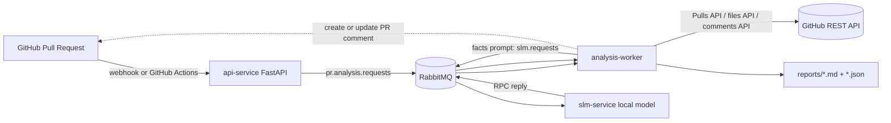

# PR Quality Analyzer

A GitHub-focused service for analyzing Pull Request quality. It receives GitHub PR events or manual analysis requests, collects changed files through the GitHub REST API, runs deterministic code-quality checks, sends normalized context to a local SLM through RabbitMQ, generates Markdown/JSON reports, and posts the final report as a managed comment on the Pull Request.

## What is included

- **GitHub webhook endpoint** for `pull_request` events.
- **Manual analysis endpoint** for GitHub Actions or local reruns.
- **RabbitMQ** queues for PR analysis jobs and SLM inference requests.
- **Analysis worker** that fetches PR metadata/files from GitHub, evaluates risk, and prepares factual review context.
- **SLM inference service** as a separate Docker image.
- **Managed GitHub PR comment**: the analyzer creates or updates a single PR timeline comment instead of creating duplicates.
- **Local artifacts**: Markdown and JSON reports saved to the `reports/` directory.

## Architecture



## Quick local start

1. Create `.env`:

```bash
cp .env.example .env
```

2. Fill the required GitHub values:

```env
GITHUB_TOKEN=github_pat_or_gh_token
GITHUB_WEBHOOK_SECRET=change-me
POST_PR_COMMENT=true
UPDATE_EXISTING_PR_COMMENT=true
```

3. Start the stack:

```bash
docker compose up --build
```

RabbitMQ UI will be available at `http://localhost:15672` with `guest` / `guest`. The API will be available at `http://localhost:8080`.

4. Send a manual GitHub PR analysis request:

```bash
curl -X POST http://localhost:8080/analyze \
  -H "Content-Type: application/json" \
  -d '{
    "owner": "my-org",
    "repo": "my-repo",
    "pull_number": 42,
    "post_comment": true
  }'
```

The worker will fetch the PR from GitHub, analyze the changed files, save reports to `./reports`, and create or update the PR comment.

## Lightweight smoke test without GitHub

You can pass changed files directly in the payload. This is useful for local testing without a real repository. The example disables PR commenting.

```bash
curl -X POST http://localhost:8080/analyze \
  -H "Content-Type: application/json" \
  --data @examples/local_job.json
```

## GitHub webhook setup

Configure a webhook in your GitHub repository:

- Payload URL: `https://<your-domain>/webhook/github`
- Content type: `application/json`
- Secret: value of `GITHUB_WEBHOOK_SECRET`
- Events: `Pull requests`

The API verifies `X-Hub-Signature-256` when `GITHUB_WEBHOOK_SECRET` is set.

Supported PR actions:

```text
opened
synchronize
reopened
ready_for_review
```

## GitHub Actions option

The included workflow can run the analyzer inside GitHub Actions and post the report back to the PR.

Workflow file:

```text
.github/workflows/pr-quality.yml
```

Required permissions:

```yaml
permissions:
  contents: read
  pull-requests: read
  issues: write
```

Why `issues: write` is required: GitHub Pull Requests are also issues for timeline comments, so the analyzer posts the PR report through the issue comments endpoint.

The workflow starts RabbitMQ, API, worker, and SLM containers locally, calls `/analyze`, waits for a report, uploads the generated artifacts, and updates the PR comment.

## PR comment behavior

The report is posted as a Pull Request timeline comment.

To avoid duplicated bot comments, the worker adds a hidden marker:

```html
<!-- pr-quality-analyzer-report -->
```

On subsequent PR updates, the worker searches existing PR comments for that marker. If it finds one, it updates that comment. If not, it creates a new one.

Relevant settings:

```env
POST_PR_COMMENT=true
UPDATE_EXISTING_PR_COMMENT=true
```

## How the report is built

The report is built in two stages.

### 1. Deterministic facts

The worker analyzes:

- PR size;
- number of changed files;
- added/deleted lines;
- dependency and lock-file changes;
- Docker, CI/CD, and infrastructure changes;
- test-file changes;
- sensitive paths such as `auth`, `security`, `payment`, `migrations`, `iam`, and `secrets`;
- risky Python patterns such as `eval`, `exec`, `pickle.loads`, `shell=True`, bare `except`, debug `print`, and `TODO/FIXME/HACK`;
- possible secret leaks such as GitHub tokens, AWS access keys, private keys, and generic secret assignments;
- missing PR description.

### 2. SLM reviewer context

The SLM receives only structured facts and limited diff excerpts. It does not make the final approval decision. It produces reviewer-oriented context with:

- reviewer summary;
- main risks;
- manual checks;
- questions for the PR author;
- suggested review attention level.

## API

### `GET /health`

API liveness check.

### `POST /analyze`

Manually enqueue a GitHub PR for analysis.

```json
{
  "owner": "my-org",
  "repo": "my-repo",
  "pull_number": 42,
  "post_comment": true
}
```

For local mode, you can pass `changed_files` without calling GitHub:

```json
{
  "owner": "local",
  "repo": "demo",
  "pull_number": 1,
  "post_comment": false,
  "changed_files": [
    {
      "filename": "src/app.py",
      "status": "modified",
      "additions": 10,
      "deletions": 2,
      "changes": 12,
      "patch": "@@ -1,2 +1,5 @@\n+print('debug')\n"
    }
  ]
}
```

### `POST /webhook/github`

Endpoint for GitHub `pull_request` webhooks.

## SLM inside a Docker image

By default, `services/slm/Dockerfile` downloads the model during image build:

```env
MODEL_ID=Qwen/Qwen2.5-Coder-0.5B-Instruct
SLM_BACKEND=transformers
```

For quick local tests without downloading the model, enable mock mode:

```env
SLM_BACKEND=mock
DOWNLOAD_MODEL_AT_BUILD=false
```

This keeps the RabbitMQ/RPC architecture intact, but returns a deterministic template summary instead of calling the model.

## Useful commands

```bash
make test
make smoke
make logs
```

Or directly:

```bash
docker compose logs -f api worker slm
```

## Required GitHub token scopes

For a fine-grained personal access token or GitHub App token, grant the equivalent of:

```text
Pull requests: read
Contents: read
Issues: write
```

For GitHub Actions, use the workflow `permissions` block shown above.
